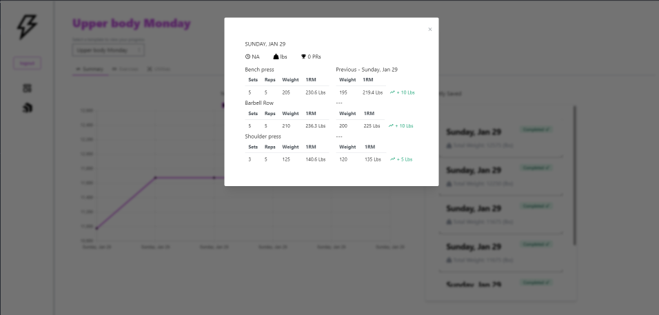

# Strength Tracker

## Strength Tracker is a web application that allows users to track their progress in gym.

# Usage

Create a account, then create a template. A template is an outline of exercises for a given workout. 
You can then click on a template, input the exercise weight, reps, sets and save it. 
Navigate to the progress page and select the template you want to view.

